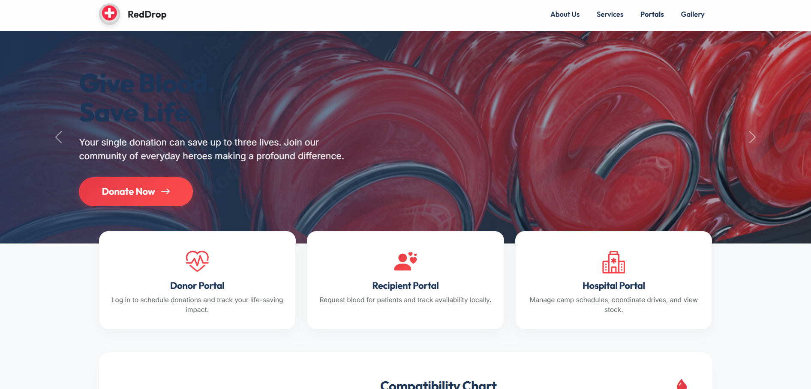

# Blood Donation Camp

A Django web application for managing blood donation camps.

## Photos

Screenshots from the Blood Donation Camp application.




## Setup Instructions

### Prerequisites
- Python 3.8+
- pip

### Installation

1. Navigate to the project directory:
   ```bash
   cd blood_donation_camp/bdweb
   ```

2. Create a virtual environment (optional but recommended):
   ```bash
   python -m venv venv
   ```

3. Activate the virtual environment:
   - **Windows:**
     ```bash
     venv\Scripts\activate
     ```
   - **macOS/Linux:**
     ```bash
     source venv/bin/activate
     ```

4. Install the required dependencies:
   ```bash
   pip install -r requirements.txt
   ```

5. Apply database migrations:
   ```bash
   python manage.py migrate
   ```

6. Run the development server:
   ```bash
   python manage.py runserver
   ```

7. Open your web browser and go to `http://127.0.0.1:8000/`.

## Technologies Used
- Django 5.2
- SQLite (default)

